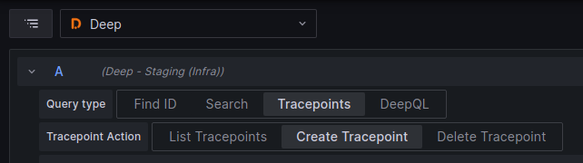

# Create Tracepoint

To create a tracepoint using Explore first select the 'Deep' data source then ensure you select 'Tracepoints -> Create
Tracepoint' as below

Now you will need to configure the tracepoint to trigger the way you need it to. To do this you **MUST** set the file
and line number (all other settings are optional).

| Config      | Default | Example                       | Description                                                                                                                                                                                                                                                                                                                               |
|-------------|---------|-------------------------------|-------------------------------------------------------------------------------------------------------------------------------------------------------------------------------------------------------------------------------------------------------------------------------------------------------------------------------------------|
| File Path   |         | simple_test.py                | This is the file path to for the **source** file in which the trigger is to be installed. This can be a full path or just the file name, the usage of this is dependant on the agent that is being used.                                                                                                                                  |
| Line number |         | 42                            | This is the line number in the **source** file where the trigger is to be installed.                                                                                                                                                                                                                                                      |   
| Fire Count  | 1       | 10                            | This is the number of times the trigger should fire before it is disabled. This count is per client not a global value. This can be set to 'Forever' to trigger the tracepoint every time (rate limiting still applies) until it is removed.                                                                                              |   
| Targeting   |         | service.name=myapp            | This is a query that is used to target triggers to specific clients based on the client resource. Using the targeting `service.name=myapp` will mean only clients that define the label `service.name` with the value `myapp` will receive this trigger.                                                                                  |   
| Log Message |         | user id = {user.id}           | This allows for dynamic log messages to be injected into the target application. These log messages will be output by the client and can be consumed by log platforms such as Loki. The log messages can contain expressions between `{}` that will be evaluated at the trigger location, allowing for the extraction of local variables. |   
| Trace       | None    | Line                          | This allows for dynamic spans to be injected, by selecting 'Line' a span will be created around the targeted line. Selecting 'Method/Function', will create a span around the enclosing method/function.                                                                                                                                  |   
| Metrics     |         | basket_size len(basket.items) | This allows for dynamic metrics to be created using the local variables. [Read more below.](#metrics)                                                                                                                                                                                                                                     |   
| Watches     |         | user.id                       | This allows for selection of specific variables when using snapshots. To learn more about watches view the docs for the [client](https://intergral.github.io/deep/#client) being used.                                                                                                                                                    |   

# Metrics

When creating metrics you can specify the metric name, and the value.

- The name should be a compatible metric lowercase and with underscores(_).
    - The metric name will be prefixed with 'deep_' to ensure we do not affect existing metrics. Meaning if the metric
      name given is 'basket_size' then the metric generated will be 'deep_basket_size'.
- The value can be:
    - A value: a fixed numeric value
    - An expression: an expression that used local variables to extract a numeric value.

When defining metrics it is important that the expression used is valid and results in a numeric value. Any errors while
processing the metrics will result in no metrics being produced, and nothing appearing in the metric endpoint. Any
errors can be seen in the client logs, if enabled.
