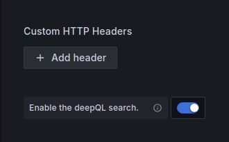
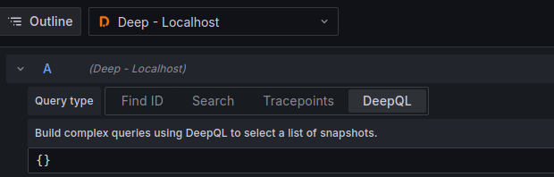

# DeepQL

DeepQL is the query language used by deep to allow interactions with Deep in a command form.

For full details of the language view the [DeepQL docs](https://intergral.github.io/deep/features/deepql/).

# Usage

To use DeepQL ensure it is enabled in the datasource config:

Then select the 'DeepQL' tab when entering a query.

From here simply enter the query and then run the query. The result will be displayed according to the result of the
query.
