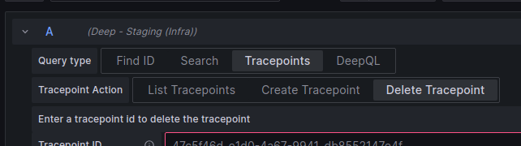

# Delete Tracepoint

To delete a tracepoint using Explore, select the Deep datasource and select 'Tracepoints -> Delete Tracepoint'.

In this section you can enter the ID of the tracepoint to delete. The ID of the tracepoint is visible in the table view
of the list tracepoint response (this should also provide a delete link). If using the 'intergral-deep-tracepoint-panel' 
plugin then a button is available to delete the tracepoint.
