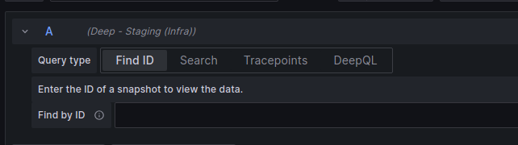

# Find ID

The simplest way to view the connected snapshots is to use 'Find ID' this requires you to provide the ID of the
snapshot to view. You can do this using the Explore page 'Find ID', while selecting a Deep datasource.

