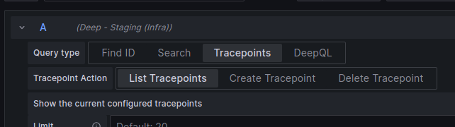

# List Tracepoint

To list the configured tracepoints using Explore, select the Deep datasource and select 'Tracepoints -> List Tracepoints'.

Using the run query button will list the available tracepoints.
