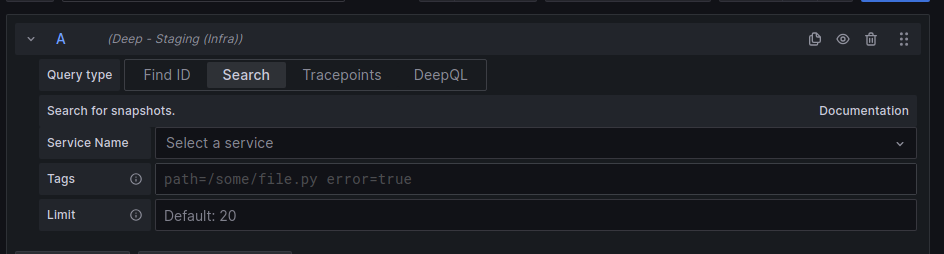

# Search

Search can be used to search for snapshots that have been triggered. Using explore open the Deep datasource and select search.

Here you can enter a query to narrow down the search.

- Service Name: This lets you select a service by name that has sent snapshots
- Tags: Here you can further filter by any attribute or resource value

The results will be shown as a table where you can select a single snapshot to view.
